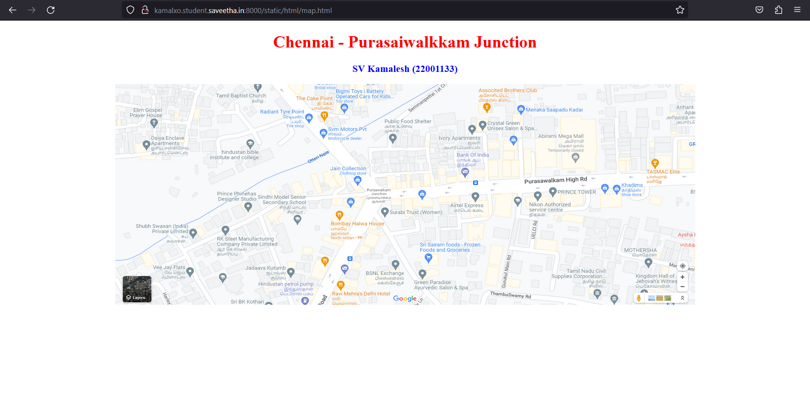
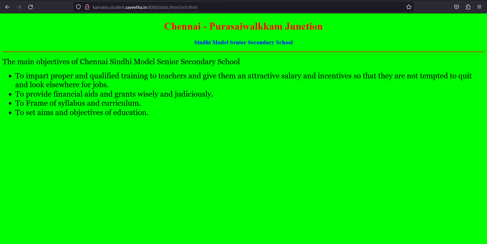
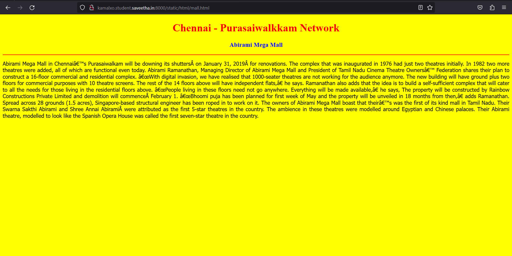
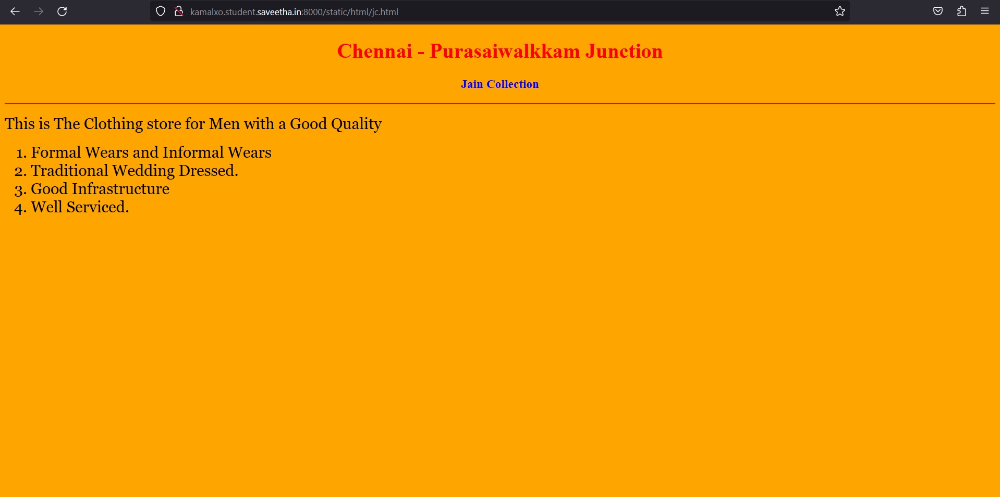
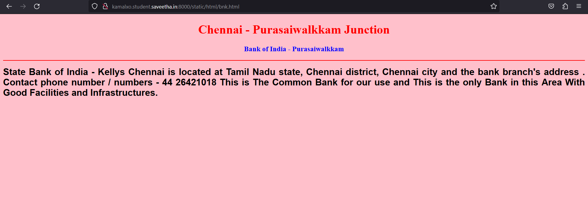
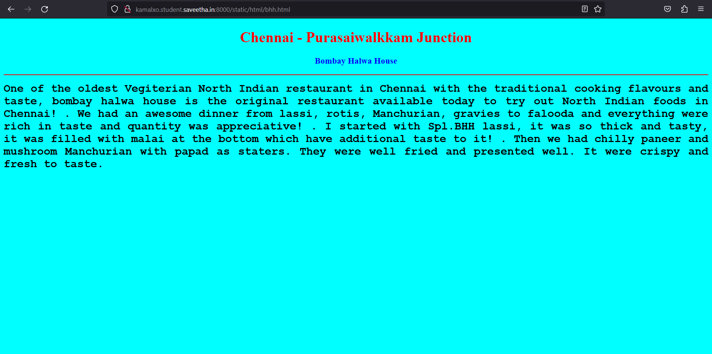
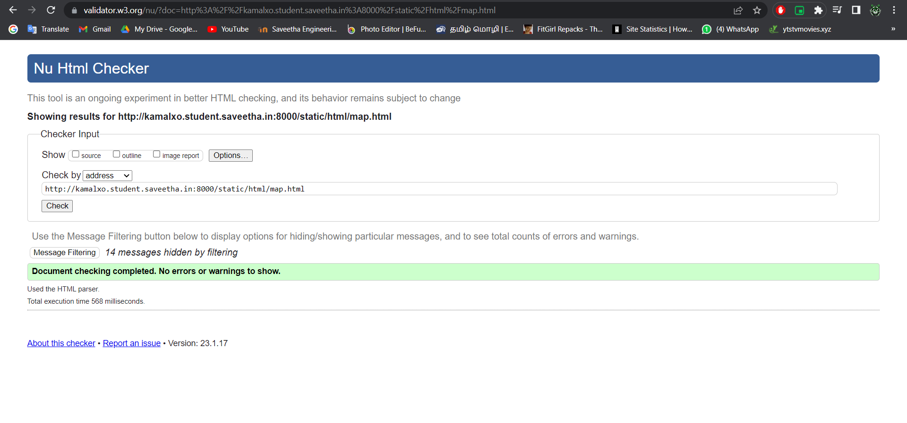

# Places Around Me
## AIM:
To develop a website to display details about the places around my house.

## Design Steps:

### Step 1:
Create a new django project and app
### Step 2:
Type code in views and urls.py
### Step 3:
create HTML files according to your places
### Step 4:
Give deatils about that places in html file
### Step 5:
Run the server

## Code:
```
map.html

<!DOCTYPE html>
<html lang="en">
<head>
<title>My City</title>
</head>
<body>
<h1 align="center">
<font color="red"><b>Chennai - Purasaiwalkkam Junction</b></font>
</h1>
<h3 align="center">
<font color="blue"><b>SV Kamalesh (22001133)</b></font>
</h3>
<center>

<map name="MyCity">
<area shape="circle" coords="590,505,15" href="/static/html/sch.html" title="Sindhi Model Senior Secondary School">
<area shape="rectangle" coords="1155,340,15" href="/static/html/bnk.html" title="Bank">
<area shape="circle" coords="800,370,10" href="/static/html/jc.html" title="">
<area shape="circle" coords="1520,280,15" href="/static/html/mall.html" title="Abirami Mega Mall">
<area shape="rectangle" coords="740,490,15" href="/static/html/bhh.html" title="Bombay Halwa House">
</map>
</center>
</body>
</html>


bhh.html

<!DOCTYPE html>
<html lang="en">
<head>
<title>Bombay Halwa House</title>
</head>
<body bgcolor="cyan">
<h1 align="center">
<font color="red"><b>Chennai - Purasaiwalkkam Junction</b></font>
</h1>
<h3 align="center">
<font color="blue"><b>Bombay Halwa House</b></font>
</h3>
<hr size="3" color="red">
<p align="justify">
<font face="Courier New" size="5">
<b>
One of the oldest Vegiterian North Indian restaurant in Chennai with the traditional cooking flavours and taste, bombay halwa house is the original restaurant available today to try out North Indian foods in Chennai!
.
We had an awesome dinner from lassi, rotis, Manchurian, gravies to falooda and everything were rich in taste and quantity was appreciative!
.
I started with Spl.BHH lassi, it was so thick and tasty, it was filled with malai at the bottom which have additional taste to it!
.
Then we had chilly paneer and mushroom Manchurian with papad as staters. They were well fried and presented well. It were crispy and fresh to taste. 
</b>
</font>
</p>
</body>
</html>


mall.html

<!DOCTYPE html>
<html lang="en">
<head>
<title>Abirami Mega Mall</title>
</head>
<body bgcolor="yellow">
<h1 align="center">
<font color="red"><b>Chennai - Purasaiwalkkam Network</b></font>
</h1>
<h3 align="center">
<font color="blue"><b>Abirami Mega Mall</b></font>
</h3>
<hr size="3" color="red">
<p align="justify">
<font face="Tahoma" size="3">
Abirami Mega Mall in Chennai’s Purasaiwalkam will be downing its shutters on January 31, 2019 for renovations. The complex that was inaugurated in 1976 had just two theatres initially. In 1982 two more theatres were added, all of which are functional even today.
Abirami Ramanathan, Managing Director of Abirami Mega Mall and President of Tamil Nadu Cinema Theatre Owners’ Federation shares their plan to construct a 16-floor commercial and residential complex.
“With digital invasion, we have realised that 1000-seater theatres are not working for the audience anymore. The new building will have ground plus two floors for commercial purposes with 10 theatre screens. The rest of the 14 floors above will have independent flats,” he says.
Ramanathan also adds that the idea is to build a self-sufficient complex that will cater to all the needs for those living in the residential floors above. “People living in these floors need not go anywhere. Everything will be made available,” he says,

The property will be constructed by Rainbow Constructions Private Limited and demolition will commence February 1. “Bhoomi puja has been planned for first week of May and the property will be unveiled in 18 months from then,” adds Ramanathan.
Spread across 28 grounds (1.5 acres), Singapore-based structural engineer has been roped in to work on it. The owners of Abirami Mega Mall boast that their’s was the first of its kind mall in Tamil Nadu. Their Swarna Sakthi Abirami and Shree Annai Abirami were attributed as the first 5-star theatres in the country. The ambience in these theatres were modelled around Egyptian and Chinese palaces. Their Abirami theatre, modelled to look like the Spanish Opera House was called the first seven-star theatre in the country.

</p>
</body>
</html>
bnk.html
<!DOCTYPE html>
<html lang="en">
<head>
<title>Bank o India</title>
</head>
<body bgcolor="pink">
<h1 align="center">
<font color="red"><b>Chennai - Purasaiwalkkam Junction</b></font>
</h1>
<h3 align="center">
<font color="blue"><b>Bank of India - Purasaiwalkkam</b></font>
</h3>
<hr size="3" color="red">
<p align="justify">
<font face="Arial" size="5">
<b>
State Bank of India - Kellys Chennai is located at Tamil Nadu state, Chennai district, Chennai city and the bank branch's address . Contact phone number / numbers - 44 26421018 

This is The Common Bank for our use and This is the only Bank in this Area With Good Facilities and Infrastructures.
</b>
</font>
</p>
</body>
</html>


sch.html

<!DOCTYPE html>
<html lang="en">
<head>
<title>Sindhi Model Senior Secondary School</title>
</head>
<body bgcolor="lime">
<h1 align="center">
<font color="red"><b>Chennai - Purasaiwalkkam Junction</b></font>
</h1>
<h3 align="center">
<font color="blue"><b>Sindhi Model Senior Secondary School</b></font>
</h3>
<hr size="3" color="red">
<p align="justify">
<font face="Georgia" size="5">
The main objectives of Chennai Sindhi Model Senior Secondary School
<ul>
<li>To impart proper and qualified training to teachers and give them an attractive salary and incentives so that they are not tempted to quit and look elsewhere for jobs.</li>
<li>To provide financial aids and grants wisely and judiciously.</li>
<li>To Frame of syllabus and curriculum.</li>
<li>To set aims and objectives of education.</li>
</ul>
</font>
</p>
</body>
</html>


jc.html

<!DOCTYPE html>
<html lang="en">
<head>
<title>Jain Collection</title>
</head>
<body bgcolor="orange">
<h1 align="center">
<font color="red"><b>Chennai - Purasaiwalkkam Junction</b></font>
</h1>
<h3 align="center">
<font color="blue"><b>Jain Collection </b></font>
</h3>
<hr size="3" color="red">
<p align="justify">
<font face="Georgia" size="5">
This is The Clothing store for Men with a Good Quality
<ol type="1">
<li>Formal Wears and Informal Wears</li>
<li>Traditional Wedding Dressed.</li>
<li>Good Infrastructure</li>
<li>Well Serviced.</li>
</ol>
</font>
</p>
</body>
</html>
```
## Output:













HTML Validation :



## Result:

the program for implemnting map has executed succesfully.